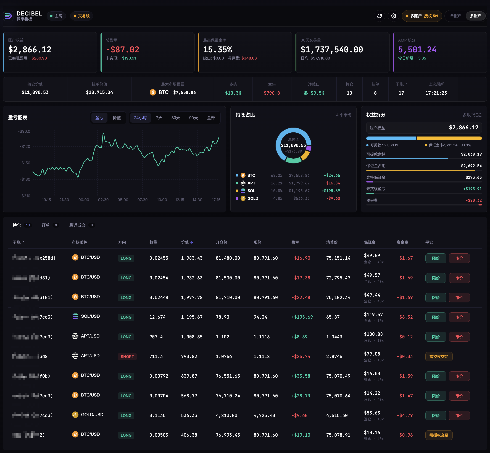

# Decibel Dashboard

Decibel Dashboard 是一个面向 Decibel 主网账户的交易看板，用于查看主钱包及其子账户的账户权益、持仓、挂单、成交记录、AMP 积分和风险数据，并支持通过钱包 Session Key 执行限价/市价平仓与撤单。

当前版本：`v0.2.1`

## 功能概览

- 只支持 Decibel 主网
- 添加 Owner Wallet 后自动读取其子账户
- 支持多个主钱包，并可查看所有账户汇总
- 展示账户权益、总盈亏、未实现盈亏、30 天交易量和 AMP 积分
- 展示持仓、挂单、最近成交、盈亏/账户价值曲线、持仓占比和权益拆分
- 摘要条展示持仓价值、挂单价值、最大市场暴露、多空价值、净敞口和刷新状态
- 持仓市场名可点击查看 Decibel 官方 K 线价格面板
- 支持本地编辑主钱包别名和子账户别名
- 支持 API Key 测试、本地配置导入导出和清除本地数据
- 默认使用 `trading` 交易版模式，也保留 `dashboard` 纯看板构建模式
- `trading` 模式支持钱包连接、Session Key 授权、Gas Station 或 Owner 付 gas、限价/市价平仓和撤单
- Bot 模块独立于主数据面板，支持 Bot 管理、策略编辑、风控规则、告警、操作记录、批量创建和导入导出



## 使用方式

安装依赖：

```bash
npm install
```

本地开发（默认交易版）：

```bash
npm run dev
```

纯看板版本地开发：

```bash
npm run dev:dashboard
```

生产构建（默认交易版）：

```bash
npm run build
```

纯看板版构建：

```bash
npm run build:dashboard
```

预览构建产物：

```bash
npm run preview
```

## 配置

打开页面后进入右上角“设置”：

1. 填写 Decibel 主网 API Key
2. 点击“测试连接”
3. 添加主钱包地址，也就是 Owner Wallet
4. 刷新或等待自动刷新后查看数据

API Key、钱包地址、别名、子账户缓存和交易授权信息默认保存在当前浏览器的 `localStorage` 中。导出的配置文件不包含 API Key 和 Gas Station Key，页面也不会把 API Key 上传到网站服务器。

默认交易版需要 Aptos 钱包授权 Session Key。启用 Gas Station 时，平仓和撤单交易由 Gas Station 代付 gas；关闭 Gas Station 时，由当前 Owner 钱包作为 fee payer 额外签名并支付 gas。

如只需要公开只读看板，可使用 `npm run build:dashboard` 构建纯看板模式。

## 数据源

项目使用 Decibel / Aptos Labs 主网 API：

```text
https://api.mainnet.aptoslabs.com/decibel/api/v1
```

K 线面板使用 Decibel 官方 `/candlesticks` 接口。

## Bot API 契约（MVP）

前端已按以下接口约定接入（`src/api/botTypes.ts`、`src/api/bots.ts`）：

- `GET /api/bots`：返回 `BotSnapshot`
- `POST /api/bots/:id/start|pause|trip|stop`
- `POST /api/alerts/:id/ack`
- `PUT /api/bots/:id`
- `DELETE /api/bots/:id`
- `PUT /api/bot-strategies/:id`
- `DELETE /api/bot-strategies/:id`
- `PUT /api/bot-risk-rules/:id`
- `DELETE /api/bot-risk-rules/:id`
- `POST /api/risk/global-kill-switch`

POST 请求会附带：

- Header: `X-Idempotency-Key`
- Body: `idempotencyKey`（以及可选 `reason`）

响应支持两种格式：

- 直接返回 `BotSnapshot`
- 或 envelope：`{ data: BotSnapshot, error?, requestId?, serverTime? }`

开发环境现在已内置本地 Bot 后端，Vite 会直接响应上述接口；如果接口不可用，前端才会降级到浏览器 `localStorage` mock 数据。更通俗的 Bot 模块说明见 `docs/bot-module-user-guide.md`，本地后端说明见 `docs/bot-backend-local.md`，Runner 数据源说明见 `docs/bot-runner-source.md`。

## 技术栈

- React
- TypeScript
- Vite
- Zustand
- Recharts

## 说明

页面展示数据依赖 Decibel API 返回结果，多账户汇总和 AMP 今日新增等部分数据为前端本地计算。AMP 今日新增以当天首次成功读取到的积分作为本地基准，仅供参考。
